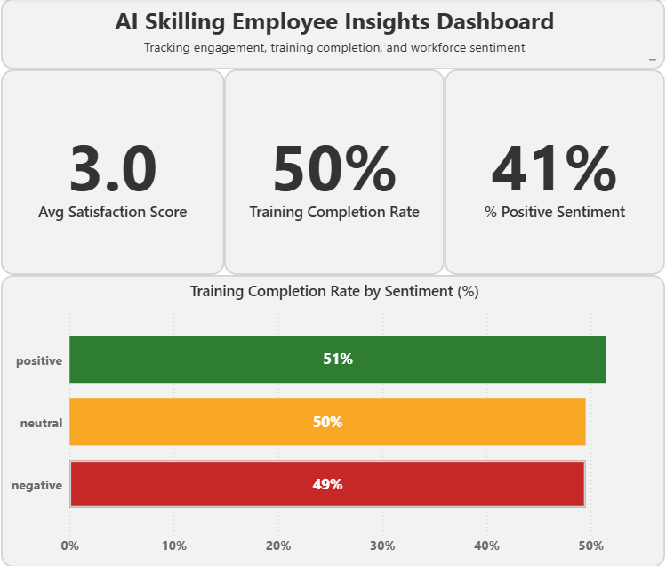

# AI Skilling Employee Insights Dashboard

This project was built as part of an application for Microsoft’s AI Skilling Data Analyst role (Job ID 1838294).

**Goal**  
Analyze HR-style employee data (survey results, training records, recruitment info) to highlight how engagement and sentiment connect to training outcomes.  

**Deliverables**  
- Jupyter/Colab notebook (`.ipynb` + PDF) with data prep, merges, sentiment tagging.  
- Power BI dashboard with executive-style visuals.  

**Dashboard Features**  
- KPI cards: Avg Satisfaction Score, Training Completion Rate, % Positive Sentiment.  
- Sentiment-colored bar chart: Training Completion by Sentiment.  
- Clean, HR-friendly data storytelling.  

**Tools Used**  
- Python (pandas, matplotlib, sklearn)  
- Power BI (KPIs, bar chart, formatting)  

**Preview**  

